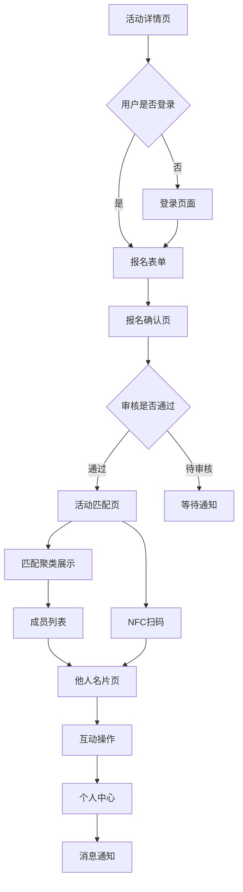

# 活动参与者用户端产品需求文档

## 1. Product Overview
活动参与者用户端网页为用户提供完整的活动参与体验，包括活动浏览、报名申请、智能匹配和社交破冰功能。
- 解决活动参与者在报名、匹配和社交过程中的痛点，通过智能算法实现精准人群匹配，提升活动参与体验和社交效率。
- 目标打造活动社交领域的专业平台，为活动组织者和参与者创造更高的匹配价值。

## 2. Core Features

### 2.1 User Roles
| Role | Registration Method | Core Permissions |
|------|---------------------|------------------|
| 普通用户 | 手机号+密码注册 | 浏览公开活动、报名参与、查看匹配结果、社交互动 |
| 认证用户 | 报名审核通过 | 访问活动匹配页、查看他人名片、使用NFC功能 |

### 2.2 Feature Module
我们的活动参与者用户端包含以下主要页面：
1. **登录页面**: 用户认证、密码找回
2. **活动详情页**: 活动信息展示、报名状态管理、操作按钮
3. **报名流程页**: 报名表单填写、信息验证、提交确认
4. **活动匹配页**: 匹配聚类展示、成员列表、NFC扫码功能
5. **他人名片页**: 个人信息展示、匹配分析、互动操作
6. **个人中心页**: 我的名片、资料编辑、消息通知

### 2.3 Page Details
| Page Name | Module Name | Feature description |
|-----------|-------------|---------------------|
| 登录页面 | 用户认证 | 账号密码登录验证，JWT Token获取，自动跳转到目标页面 |
| 登录页面 | 权限控制 | 未登录用户访问受保护页面时自动跳转，保持目标页面状态 |
| 活动详情页 | 信息展示 | 显示活动封面、标题、时间地点、人数费用、主办方信息、详细描述 |
| 活动详情页 | 状态管理 | 根据用户报名状态动态显示操作按钮：报名/已提交/进入活动 |
| 报名流程页 | 表单填写 | 收集用户信息，表单验证，支持多种字段类型和必填项检查 |
| 报名流程页 | 提交确认 | 显示提交成功状态，说明后续流程，提供导航选项 |
| 活动匹配页 | 活动信息卡 | 固定顶部显示活动基本信息，活动公告，匹配规则说明 |
| 活动匹配页 | 匹配聚类区 | 展示智能分组结果，显示聚类名称、相关度分数、候选人数 |
| 活动匹配页 | NFC扫码功能 | 提供现场碰一碰和扫码匹配，直接跳转名片页面 |
| 活动匹配页 | 成员列表 | 显示聚类成员信息，支持排序筛选，无限滚动加载 |
| 他人名片页 | 名片信息 | 展示用户头像、姓名、角色、标签、个人简介 |
| 他人名片页 | 匹配分析 | 显示综合匹配分、维度拆解图表、推荐开场话题 |
| 他人名片页 | 互动操作 | 打招呼消息发送，联系方式交换，双方同意机制 |
| 个人中心页 | 我的名片 | 查看个人名片展示效果，快速编辑入口 |
| 个人中心页 | 资料编辑 | 修改头像、基本信息、职业标签、个人简介 |
| 个人中心页 | 消息通知 | 查看系统通知和他人打招呼消息，消息状态管理 |

## 3. Core Process
**主要用户操作流程：**

**未认证用户流程：**
用户访问活动详情 → 浏览公开信息 → 点击报名 → 跳转登录页 → 完成登录 → 填写报名表单 → 提交等待审核

**认证用户流程：**
登录用户访问活动 → 查看详细信息 → 报名参与 → 审核通过 → 进入匹配页 → 浏览匹配聚类 → 查看成员列表 → 点击他人名片 → 查看匹配分析 → 发起社交互动

**NFC/扫码流程：**
现场用户 → 使用NFC碰一碰或扫码 → 直接打开对方名片 → 查看匹配分析 → 进行互动操作

## 4. User Interface Design
### 4.1 Design Style
- **主色调**: #3B82F6 (蓝色系) 用于主要操作按钮和重要信息
- **辅助色**: #10B981 (绿色) 用于成功状态，#F59E0B (橙色) 用于警告，#EF4444 (红色) 用于错误
- **按钮风格**: 圆角矩形按钮，8px圆角，渐变背景，微阴影效果
- **字体**: 系统默认字体栈，标题16-24px，正文14-16px，辅助信息12px
- **布局风格**: 卡片式设计，8px间距，顶部导航栏，底部安全区域适配
- **图标风格**: 使用lucide-react线性图标，简洁现代风格

### 4.2 Page Design Overview
| Page Name | Module Name | UI Elements |
|-----------|-------------|-------------|
| 登录页面 | 认证表单 | 居中卡片布局，品牌Logo，输入框圆角设计，主色调登录按钮，忘记密码链接 |
| 活动详情页 | 封面区域 | 全宽头图，渐变遮罩，白色标题文字，返回按钮浮层 |
| 活动详情页 | 信息卡片 | 白色背景卡片，图标+文字信息，分割线，底部固定操作按钮 |
| 报名流程页 | 表单区域 | 分步骤表单，进度指示器，输入框聚焦效果，验证错误提示 |
| 活动匹配页 | 顶部信息栏 | 固定定位，活动缩略图，标题时间，公告折叠展开 |
| 活动匹配页 | 聚类卡片 | 网格布局，圆角卡片，渐变背景，匹配度进度条，人数标识 |
| 活动匹配页 | NFC按钮 | 底部浮动按钮，圆形设计，脉冲动画效果，扫码图标 |
| 成员列表页 | 筛选工具栏 | 顶部固定，标签式筛选，排序下拉菜单，搜索输入框 |
| 成员列表页 | 成员卡片 | 头像圆形，标签彩色，共同点高亮，右箭头指示 |
| 他人名片页 | 个人信息区 | 大头像居中，姓名角色，标签云展示，简介文字 |
| 他人名片页 | 匹配分析区 | 分数圆环图，维度条形图，话题推荐卡片，动画过渡 |
| 他人名片页 | 操作按钮区 | 底部固定，双按钮布局，主次色彩区分，触觉反馈 |
| 个人中心页 | 名片预览 | 模拟真实名片效果，阴影立体感，编辑浮动按钮 |
| 个人中心页 | 消息列表 | 时间轴布局，未读红点，消息类型图标，滑动操作 |

### 4.3 Responsiveness
- **移动端优先设计**: 基于375px宽度设计，向上适配到768px平板和1024px桌面
- **触摸交互优化**: 按钮最小44px点击区域，滑动手势支持，长按操作反馈
- **自适应布局**: 使用Flexbox和Grid布局，断点响应式设计，内容优先级调整