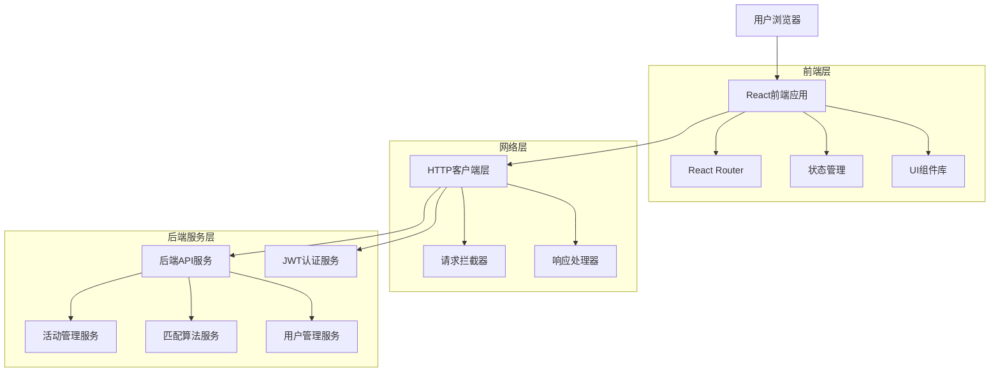
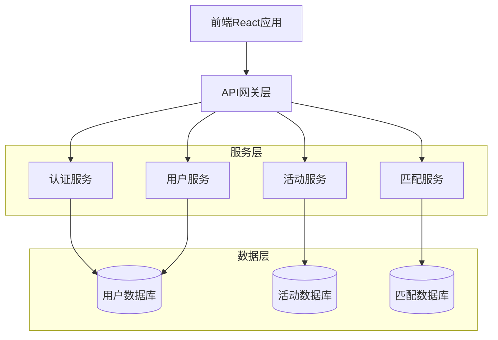
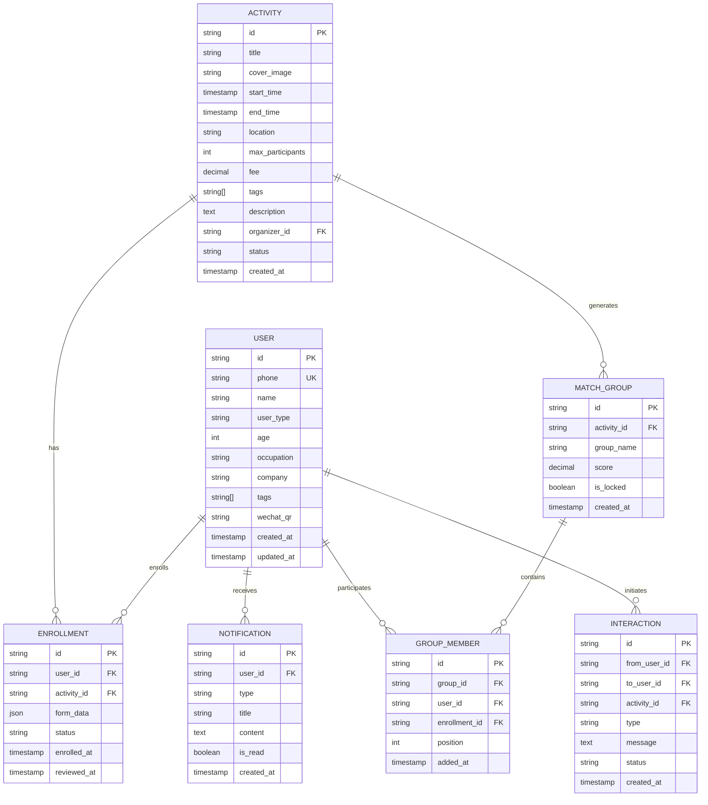

# 活动参与者用户端技术架构文档

## 1. Architecture design



## 2. Technology Description
- **前端**: React@18 + React Router@6 + Tailwind CSS@3 + Vite + lucide-react
- **状态管理**: React Hooks (useState, useEffect, useContext) + Zustand (可选)
- **HTTP客户端**: Fetch API / Axios + JWT Token认证
- **构建工具**: Vite + TypeScript
- **UI组件**: 自定义组件 + Tailwind CSS样式系统

## 3. Route definitions
| Route | Purpose |
|-------|---------|
| / | 首页重定向或活动列表页 |
| /login | 用户登录页面，JWT Token获取 |
| /activities/:id | 活动详情页，展示活动信息和报名状态 |
| /activities/:id/enroll | 报名表单页，收集用户报名信息 |
| /activities/:id/enroll/thanks | 报名成功确认页，显示后续流程 |
| /activities/:id/match | 活动匹配页，展示智能匹配结果 |
| /activities/:id/match/members/:groupId | 匹配成员列表页，显示特定聚类成员 |
| /cards | 个人名片页，查看和管理个人信息 |
| /cards/edit | 名片编辑页，修改个人资料 |
| /notifications | 消息通知页，查看系统和用户消息 |
| /p/:slug | 他人名片页，查看匹配分析和互动 |

## 4. API definitions
### 4.1 Core API

**用户认证相关**
```
POST /api/auth/login
```

Request:
| Param Name| Param Type  | isRequired  | Description |
|-----------|-------------|-------------|-------------|
| phone     | string      | true        | 用户手机号 |
| password  | string      | true        | 用户密码 |

Response:
| Param Name| Param Type  | Description |
|-----------|-------------|-------------|
| token     | string      | JWT认证令牌 |
| user      | User        | 用户基本信息 |

Example:
```json
{
  "phone": "13800138000",
  "password": "password123"
}
```

**获取当前用户信息**
```
GET /api/auth/me
```

Response:
| Param Name| Param Type  | Description |
|-----------|-------------|-------------|
| id        | string      | 用户唯一标识 |
| name      | string      | 用户姓名 |
| phone     | string      | 手机号 |
| user_type | string      | 用户类型 |
| tags      | string[]    | 用户标签 |

**活动详情获取**
```
GET /api/activities/:id
```

Response:
| Param Name| Param Type  | Description |
|-----------|-------------|-------------|
| id        | string      | 活动ID |
| title     | string      | 活动标题 |
| cover_image| string     | 封面图片URL |
| start_time| string      | 开始时间 |
| location  | string      | 活动地点 |
| max_participants| number| 最大参与人数 |
| fee       | number      | 活动费用 |

**报名提交**
```
POST /api/activities/:id/enroll
```

Request:
| Param Name| Param Type  | isRequired  | Description |
|-----------|-------------|-------------|-------------|
| form_data | object      | true        | 报名表单数据 |

**获取匹配结果**
```
GET /api/match-groups/:activityId
```

Response:
| Param Name| Param Type  | Description |
|-----------|-------------|-------------|
| groups    | MatchGroup[]| 匹配分组列表 |
| ungroupedMembers| Member[]| 未分组成员 |
| statistics| object      | 匹配统计信息 |

**获取他人名片**
```
GET /api/cards/:slug
```

Response:
| Param Name| Param Type  | Description |
|-----------|-------------|-------------|
| user      | User        | 用户基本信息 |
| match_analysis| object   | 匹配分析数据 |
| interaction_history| object[]| 互动历史 |

## 5. Server architecture diagram


## 6. Data model
### 6.1 Data model definition


### 6.2 Data Definition Language
**用户表 (users)**
```sql
-- 创建用户表
CREATE TABLE users (
    id UUID PRIMARY KEY DEFAULT gen_random_uuid(),
    phone VARCHAR(20) UNIQUE NOT NULL,
    name VARCHAR(100) NOT NULL,
    user_type VARCHAR(20) DEFAULT 'user' CHECK (user_type IN ('user', 'organizer', 'admin')),
    age INTEGER,
    occupation VARCHAR(100),
    company VARCHAR(200),
    tags TEXT[] DEFAULT '{}',
    wechat_qr TEXT,
    avatar_url TEXT,
    bio TEXT,
    created_at TIMESTAMP WITH TIME ZONE DEFAULT NOW(),
    updated_at TIMESTAMP WITH TIME ZONE DEFAULT NOW()
);

-- 创建索引
CREATE INDEX idx_users_phone ON users(phone);
CREATE INDEX idx_users_user_type ON users(user_type);
CREATE INDEX idx_users_tags ON users USING GIN(tags);
```

**活动表 (activities)**
```sql
-- 创建活动表
CREATE TABLE activities (
    id UUID PRIMARY KEY DEFAULT gen_random_uuid(),
    title VARCHAR(200) NOT NULL,
    cover_image TEXT,
    start_time TIMESTAMP WITH TIME ZONE NOT NULL,
    end_time TIMESTAMP WITH TIME ZONE NOT NULL,
    location VARCHAR(300) NOT NULL,
    max_participants INTEGER DEFAULT 100,
    fee DECIMAL(10,2) DEFAULT 0,
    tags TEXT[] DEFAULT '{}',
    description TEXT,
    organizer_id UUID REFERENCES users(id),
    status VARCHAR(20) DEFAULT 'draft' CHECK (status IN ('draft', 'published', 'ongoing', 'completed', 'cancelled')),
    created_at TIMESTAMP WITH TIME ZONE DEFAULT NOW(),
    updated_at TIMESTAMP WITH TIME ZONE DEFAULT NOW()
);

-- 创建索引
CREATE INDEX idx_activities_start_time ON activities(start_time);
CREATE INDEX idx_activities_status ON activities(status);
CREATE INDEX idx_activities_organizer_id ON activities(organizer_id);
```

**报名表 (enrollments)**
```sql
-- 创建报名表
CREATE TABLE enrollments (
    id UUID PRIMARY KEY DEFAULT gen_random_uuid(),
    user_id UUID REFERENCES users(id) ON DELETE CASCADE,
    activity_id UUID REFERENCES activities(id) ON DELETE CASCADE,
    form_data JSONB NOT NULL DEFAULT '{}',
    status VARCHAR(20) DEFAULT 'pending' CHECK (status IN ('pending', 'approved', 'rejected', 'cancelled')),
    enrolled_at TIMESTAMP WITH TIME ZONE DEFAULT NOW(),
    reviewed_at TIMESTAMP WITH TIME ZONE,
    UNIQUE(user_id, activity_id)
);

-- 创建索引
CREATE INDEX idx_enrollments_user_id ON enrollments(user_id);
CREATE INDEX idx_enrollments_activity_id ON enrollments(activity_id);
CREATE INDEX idx_enrollments_status ON enrollments(status);
```

**匹配分组表 (match_groups)**
```sql
-- 创建匹配分组表
CREATE TABLE match_groups (
    id UUID PRIMARY KEY DEFAULT gen_random_uuid(),
    activity_id UUID REFERENCES activities(id) ON DELETE CASCADE,
    group_name VARCHAR(100) NOT NULL,
    score DECIMAL(5,2) DEFAULT 0,
    is_locked BOOLEAN DEFAULT FALSE,
    created_at TIMESTAMP WITH TIME ZONE DEFAULT NOW()
);

-- 创建索引
CREATE INDEX idx_match_groups_activity_id ON match_groups(activity_id);
CREATE INDEX idx_match_groups_score ON match_groups(score DESC);
```

**分组成员表 (group_members)**
```sql
-- 创建分组成员表
CREATE TABLE group_members (
    id UUID PRIMARY KEY DEFAULT gen_random_uuid(),
    group_id UUID REFERENCES match_groups(id) ON DELETE CASCADE,
    user_id UUID REFERENCES users(id) ON DELETE CASCADE,
    enrollment_id UUID REFERENCES enrollments(id) ON DELETE CASCADE,
    position INTEGER,
    added_at TIMESTAMP WITH TIME ZONE DEFAULT NOW(),
    UNIQUE(group_id, user_id)
);

-- 创建索引
CREATE INDEX idx_group_members_group_id ON group_members(group_id);
CREATE INDEX idx_group_members_user_id ON group_members(user_id);
```

**初始化数据**
```sql
-- 插入测试用户数据
INSERT INTO users (phone, name, user_type, occupation, company, tags) VALUES
('13800138000', '张三', 'user', '产品经理', '阿里巴巴', ARRAY['互联网', '产品', 'AI']),
('13800138001', '李四', 'user', '软件工程师', '腾讯', ARRAY['技术', '后端', 'Go']),
('13800138002', '王五', 'organizer', '创业者', '创新科技', ARRAY['创业', '投资', '区块链']);

-- 插入测试活动数据
INSERT INTO activities (title, start_time, end_time, location, max_participants, fee, tags, description, organizer_id, status) VALUES
('AI创业者聚会', '2024-02-01 19:00:00+08', '2024-02-01 22:00:00+08', '北京朝阳区望京SOHO', 50, 99.00, ARRAY['AI', '创业', '技术'], '聚焦AI领域的创业者交流活动', (SELECT id FROM users WHERE phone = '13800138002'), 'published');
```